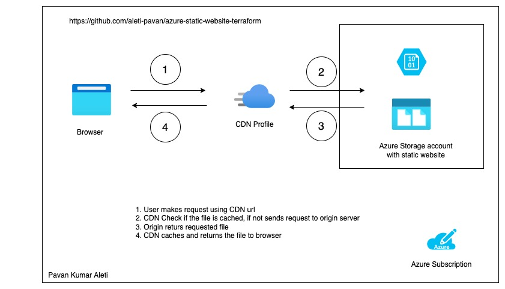

# Hosting Static Website in Azure with terraform
This repository contains terraform code to host static website in azure with azure CDN




## Prerequisites

  `1. Azure subscription`

You should have Azure Subscription to create the resources.
  `2. `
You should deploy az cli in your work station.
  
  3. az account show

```

## Commands

### Clone

`git clone https://github.com/aleti-pavan/azure-static-website-terraform.git`

### Create

```

terraform init

terraform plan or terraform -out <planfile>

terraform apply -auto-approve  (or) terraform apply <planfile>


```

### Destroy

`terraform destroy -auto-approve`
